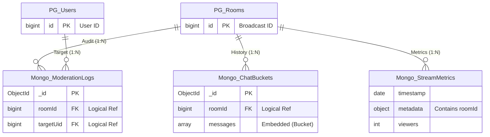

# [Database Design] 쇼핑 라이브 채팅 시스템 MongoDB 설계 명세 및 선정 근거

## 1. 개요 (Overview)
본 문서는 **OnPick 쇼핑 라이브** 서비스의 채팅 및 데이터 로그 저장을 위한 MongoDB 설계 명세서입니다.
본 프로젝트는 **RDB(PostgreSQL)**와 **NoSQL(MongoDB)**을 함께 사용하는 **Polyglot Persistence** 전략을 채택했습니다. 
* **PostgreSQL**: 정합성이 중요한 회원 및 결제 데이터 담당
* **MongoDB**: 대규모 쓰기 트래픽과 비정형 데이터 처리가 필요한 채팅 및 로그 시스템 담당

---

## 2. 핵심 설계 전략 (Core Strategy)
대규모 트래픽 환경에서 **쓰기 최적화(Write Optimization)**와 **이력 조회 효율성(Read Optimization)**을 동시에 달성하기 위해 다음 전략을 수립했습니다.

* **Hot/Cold Path 분리**: 실시간 메시지 전송은 **Redis Pub/Sub** (In-Memory)으로 처리하고, 영구 저장은 **MongoDB** (Disk)로 비동기 처리합니다.
* **버킷 패턴 (Bucket Pattern)**: 채팅 메시지를 개별 문서로 저장하지 않고, 시간/개수 단위로 묶어 저장하여 인덱스 크기를 줄이고 페이징 성능을 극대화합니다.
* **데이터 수명주기 관리 (Lifecycle Management)**: **TTL Index**를 활용하여 오래된 데이터를 자동 소거하고 **S3**로 이관하는 파이프라인을 구축합니다.

---

## 3. 상세 컬렉션 설계 및 선정 이유 (Schema & Rationale)

### A. 채팅 버킷 (`live_chat_buckets`)
사용자 채팅, 입장 알림, 구매 인증 등 방송 내 모든 인터랙션을 저장합니다.

* **설계 패턴**: Bucket Pattern (메시지 50~100개를 하나의 문서에 배열로 저장)
* **참조 방식**: Parent Reference (roomId로 PostgreSQL의 방송 테이블 참조)


```json
// Collection: live_chat_buckets
{
  "_id": ObjectId("65c4..."),
  "roomId": 1005,                    // [Partition Key] 방송 ID
  "batchIdx": 150,                   // 페이징 순서 제어
  "startTime": ISODate("..."),
  "endTime": ISODate("..."),         // 조회 시 Range Query 조건
  "msgCount": 50,
  "messages": [                      // [Embedded] 메시지 배열
    {
      "ts": ISODate("..."),
      "type": "TALK",
      "sender": {                    // [Denormalization] Join 방지용 데이터 박제
        "uid": 501,
        "nick": "지름신",
        "badge": "VIP"
      },
      "content": "재고 있나요?"
    }
    // ... (최대 50개)
  ]
}
```

### ✅ 왜 이 기능에 MongoDB(Bucket Pattern)를 선택했는가?

단순히 NoSQL을 쓰는 것을 넘어, **OnPick**의 대규모 트래픽을 견디기 위해 **Bucket Pattern**을 선택한 구체적인 이유는 다음과 같습니다.

#### 1. I/O 및 인덱스 최적화 (Index Size Reduction)
일반적인 모델에서는 채팅 메시지 1건당 1개의 Document를 생성합니다. 이 경우 100만 건의 채팅이 발생하면 100만 개의 인덱스 엔트리가 생성되어 메모리 부하가 커집니다.
* **버킷 패턴 적용 시**: 메시지를 50개 단위로 묶으면 문서 수가 **1/50(2만 건)**으로 줄어듭니다.
* **결과**: 쓰기(Write) 부하가 줄어들고, 인덱스가 메모리(RAM) 내에 상주할 가능성이 높아져 전체적인 시스템 성능이 비약적으로 향상됩니다.

#### 2. 조회 성능 극대화 (Data Locality & Sequential I/O)
라이브 채팅의 특성상 사용자는 항상 "최근 N개의 메시지"를 조회합니다.
* **일반 모델**: 50개의 메시지를 가져오기 위해 디스크의 서로 다른 위치를 참조하는 **Random I/O**가 최대 50번 발생할 수 있습니다.
* **버킷 패턴 적용 시**: 단 **1번의 Sequential I/O**로 50개의 메시지가 담긴 문서를 통째로 읽어옵니다. 
* **결과**: 네트워크 오버헤드가 감소하고 데이터 지역성(Data Locality) 이점을 극대화하여 페이징 속도가 매우 빠릅니다.

#### 3. 복합 비정형 데이터 수용 (Schema Flexibility)
채팅창에는 단순 텍스트 외에도 다양한 형태의 데이터가 오갑니다.
* **데이터 다양성**: '구매 인증 뱃지', '실시간 상품 카드', '이벤트 당첨 알림' 등.
* **결과**: RDB처럼 별도의 조인(Join) 테이블을 만들거나 `NULL` 컬럼을 양산할 필요 없이, MongoDB의 유연한 스키마를 통해 메시지 배열 안에 각기 다른 형태의 JSON 데이터를 효율적으로 박제(Denormalization)할 수 있습니다.

---

### B. 운영 제재 내역 (`moderation_logs`)
관리자에 의한 강퇴(Ban), 음소거(Mute), 메시지 삭제 로그 등 서비스 내 모든 제재 이력을 투명하게 관리합니다.

* **설계 패턴**: Standard Document (1건 = 1문서)
* **참조 방식**: Multiple Parent Reference (`roomId` + `targetUid`)

```json
// Collection: moderation_logs
{
  "_id": ObjectId("65c5..."),
  "roomId": 1005,                // 방송 ID (PG_Rooms 참조)
  "targetUid": 880,              // 제재 대상 유저 (PG_Users 참조)
  "adminUid": 999,               // 처리한 관리자 ID
  "action": "BAN",               // 제재 유형: BAN, MUTE, DELETE
  "reason": "욕설 및 비방",        // 제재 사유
  "originalContent": "야이...",   // [Optional] 삭제된 메시지 원본 (증거 자료)
  "duration": 3600,              // [Optional] 제재 지속 시간 (초 단위)
  "createdAt": ISODate("...")    // 제재 일시
}
```
### ✅ 왜 이 기능에 MongoDB를 선택했는가?

운영 제재 내역은 데이터의 정형성보다는 **다양한 형태의 로그 보존**과 **변경에 유연한 구조**가 중요하기 때문에 MongoDB를 선택했습니다.

#### 1. 스키마 유연성을 통한 다형성(Polymorphism) 구현
제재 유형(`action`)에 따라 저장해야 할 필드가 각기 다릅니다.
* **MUTE (음소거)**: 제재가 유지될 시간(`duration`) 필드가 필수입니다.
* **DELETE (메시지 삭제)**: 삭제 사유 증빙을 위한 원본 텍스트(`originalContent`) 보존이 핵심입니다.
* **RDB와의 차이**: RDB에서 이를 구현하려면 수많은 `Nullable` 컬럼을 생성하거나 별도의 상세 테이블을 조인해야 하지만, MongoDB는 문서별로 필요한 필드만 동적으로 저장하여 저장 공간을 최적화하고 모델을 단순하게 유지할 수 있습니다.


#### 2. Audit Trail(감사 로그) 용이성
제재 기록은 단순한 데이터가 아니라, 추후 CS 대응 및 법적 분쟁 시 활용될 **증거 자료**의 성격이 강합니다.
* **데이터 보존**: 텍스트, 이미지 경로, 메타데이터 등 다양한 형태의 이력을 JSON 구조 하나에 온전히 담을 수 있어 이력 관리가 직관적입니다.
* **확장성**: 향후 '경고 횟수 누적', '제재 시점의 시청자 수' 등 새로운 로그 항목이 추가되더라도 기존 로직을 수정하지 않고 즉시 반영할 수 있는 확장성을 가집니다.

---
### C. 방송 통계 시계열 (`stream_metrics`)
방송 중 발생하는 실시간 시청자 수, 채팅 발생량, 좋아요 수 등의 변화 추이를 저장하여 분석에 활용합니다.

* **설계 패턴**: Time Series Collection (MongoDB 5.0+ Native Feature)
* **설정**: `timeField: "timestamp"`, `metaField: "metadata"`, `granularity: "seconds"`

```json
// Collection: stream_metrics
{
  "timestamp": ISODate("2024-02-09T10:01:00"),
  "metadata": { "roomId": 1005 }, // [Shard Key] 방송 ID별 그룹화
  "viewers": 1520,                // 실시간 시청자 수
  "chatCount": 45                 // 해당 초당 채팅 발생량
}
```

### ✅ 왜 이 기능에 MongoDB(Time Series)를 선택했는가?

라이브 방송의 특성상 초 단위로 쏟아지는 방대한 지표 데이터를 효율적으로 관리하기 위해 MongoDB 5.0+의 **Native Time Series** 기능을 선택했습니다.

#### 1. 압도적인 데이터 압축 효율 (Columnar Compression)
라이브 방송은 실시간 시청자 수, 좋아요 수 등 초 단위의 대량 지표 데이터가 발생하여 스토리지 부하가 큽니다.
* **압축 메커니즘**: MongoDB의 Time Series 컬렉션은 유사한 시간대의 데이터를 내부적으로 **컬럼 기반(Column-oriented)**으로 압축하여 저장합니다.
* **결과**: 일반 컬렉션 대비 저장 공간을 획기적으로 절약할 수 있으며, 이는 디스크 I/O 감소와 스토리지 유지 비용 절감으로 이어집니다.

#### 2. 시계열 분석 및 윈도우 쿼리 최적화
"방송 시작 후 10분 단위 평균 시청자 수 추이"와 같이 시간 흐름에 따른 복잡한 집계 쿼리가 빈번하게 발생합니다.
* **Aggregation 최적화**: 시계열 전용 인덱스와 `$setWindowFields` 같은 연산자를 지원하여, `Moving Average`(이동 평균)나 `Downsampling`(데이터 축소) 쿼리를 Aggregation Framework에서 고속으로 처리합니다.
* **결과**: 대시보드 시각화 구현 시 백엔드 연산 부하를 최소화하면서 유저에게 실시간에 가까운 통계 응답 속도를 보장합니다.

---

## 4. 데이터 관계도 (ER Diagram)
RDB(PostgreSQL)의 정형 데이터와 MongoDB의 비정형 데이터 간의 논리적 연결 구조입니다. 두 데이터베이스는 물리적으로 분리되어 있으나, `roomId`와 `userId`를 통해 논리적으로 연결됩니다.

[Image of Polyglot Persistence Architecture with PostgreSQL and MongoDB]



## 5. 데이터 생명주기 전략 (Lifecycle Strategy)
저장 공간 효율화와 성능 유지를 위해 데이터의 성격(Hot/Cold)에 따라 **3단계 수명 주기**를 적용하여 관리합니다.

### 5.1 실시간 단계 (Hot - In-Memory)
* **목적**: 0.1초 이내의 초저지연 메시지 전달
* **처리**: **Redis Pub/Sub**을 통해 구독 중인 클라이언트에게 실시간 메시지 전송.
* **버퍼링**: 순간적인 트래픽 스파이크(Spike) 발생 시 **Redis List**에 메시지를 임시 적재하여 시스템 부하를 방지하는 완충 지대 역할을 수행합니다.

### 5.2 최근 이력 단계 (Cold - Recent)
* **목적**: 데이터 영구 저장 및 신규 입장자를 위한 최근 대화 내용 제공
* **처리**: Spring Boot 스케줄러가 정기적으로 Redis 버퍼를 비우며 **MongoDB ChatBucket**에 **Bulk Insert**를 수행합니다.
* **활용**: 사용자가 방송 입장 시, MongoDB에서 최신 버킷(최근 50~100개 메시지)을 로드하여 이전 대화 흐름을 즉시 파악할 수 있게 합니다.


### 5.3 아카이빙 단계 (Archive)
* **목적**: 스토리지 비용 절감 및 장기 데이터 법적 보존(Audit)
* **처리**:
    * **TTL(Time-To-Live) Index** 설정: 특정 기간(예: `expireAfterSeconds: 604800` - 7일)이 지난 데이터를 자동 삭제하도록 설정합니다.
    * **데이터 이관**: 데이터가 삭제되기 직전, **Spring Batch**가 야간에 실행되어 해당 데이터를 **S3/MinIO**로 압축 파일(JSON/CSV) 형태로 이관합니다.
* **결과**: MongoDB의 작업 셋(Working Set)을 작게 유지하여 최상의 성능을 확보하는 동시에, 필요시 과거 로그를 추적할 수 있는 인프라를 구축합니다.

---

## 6. 결론 (Conclusion)

본 설계는 **OnPick** 서비스의 급격한 트래픽 성장에 유연하게 대응할 수 있도록 구조화되었습니다.

* **성능(Performance)**: Redis의 인메모리 속도와 MongoDB의 강력한 비동기 쓰기 성능을 결합하여 대규모 동시 접속 환경의 트래픽을 안정적으로 수용합니다.
* **효율(Efficiency)**: **Bucket Pattern**과 **Time Series** 전용 컬렉션을 통해 인덱스 크기를 최소화하고 스토리지 저장 공간을 최적화했습니다.
* **무결성(Integrity)**: 핵심 비즈니스 데이터는 PostgreSQL이, 대용량 로그성 데이터는 MongoDB가 담당하는 **Polyglot Persistence** 전략을 통해 데이터 무결성과 시스템 확장성을 동시에 잡았습니다.

이 아키텍처를 통해 **OnPick**은 대용량 라이브 커머스 환경에서도 중단 없고 안정적인 고성능 채팅 서비스를 사용자에게 제공할 수 있습니다.
