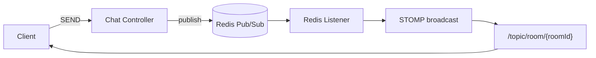

# 목표 (G0 기준)

```
✔ 단일 서버 simple broker 구조에서 벗어나기
✔ 향후 scale-out(G0.5 이상)에서도 메시지 전파 구조 유지
✔ 채팅 메시지를 Redis 기반으로 fan-out 하기
✔ 포트폴리오/면접에서 아키텍처 설명력 확보
```

---

# 왜 Simple Broker → Redis Pub/Sub으로 바꾸나?

Spring STOMP 기본(simple broker)은:

```
한 서버 내부 메모리 브로드캐스트
```

즉:

```
App 인스턴스가1대일 때만 정상 동작
```

하지만 우리가 목표하는 구조는:

```
app =3대 이상 scale-out 가능
```

이 경우 문제가 생긴다:

```
A 서버에 연결된 사용자만 메시지 받음
B 서버 사용자에게는 전달 안 됨
```

그래서:

> 서버 밖의 공통 메시지 허브가 필요 → Redis Pub/Sub 사용
> 

---

# 핵심 개념 — Fan-out이란?

Fan-out =

```
메시지 1개 입력
→ 여러 구독자에게 동시에 확산 전달
```

채팅에서는:

```
한 명이 보낸 메시지
→ 같은 방에 있는 모든 사용자에게 전달
```

Redis Pub/Sub이 이 역할을 수행한다.

---

# 전체 메시지 흐름 (Redis fan-out 구조)

```
클라이언트 SEND
→ 서버 메시지 검증
→ Redis publish
→ Redis subscriber listener 수신
→ STOMP topic broadcast
→ 각 클라이언트 수신
```



---

# 단계별 동작 설명

## ① 클라이언트가 메시지 SEND

```
/app/chat.send
```

서버 진입

---

## ② 서버에서 SEND 검증 수행

G0 기준 검증: publish 전에 반드시 검증

```
roomId 존재
JWT 인증content 길이
빈 메시지 여부
```

---

## ③ Redis로 publish

서버가 직접 broadcast 하지 않고:

```
Redis 채널로 publish
```

예:

```
channel = chat.room.3
```

---

## ④ Redis subscriber listener 수신

모든 App 인스턴스는:

```
Redis 구독 상태 유지
```

따라서:

```
어느 서버가 publish 해도
모든 서버가 메시지를 받음
```

---

## ⑤ 각 서버가 STOMP topic broadcast

```
/topic/room/3
```

으로 브로드캐스트

→ 각 서버에 연결된 클라이언트에게 전달

---

# 왜 G0에서도 Redis Pub/Sub을 붙이나?

G0는 단일 서버지만, 지금 붙이는 이유:

```
✔ G0.5 scale-out 준비
✔ 구조 재작성 없이 확장 가능
✔ 아키텍처 일관성 유지
```

---

# Simple Broker vs Redis Pub/Sub 차이

| 항목 | Simple Broker | Redis Pub/Sub |
| --- | --- | --- |
| 범위 | 단일 서버 | 멀티 서버 |
| 확장성 | 낮음 | 높음 |
| 외부 의존 | 없음 | Redis 필요 |
| scale-out | 불가 | 가능 |
| 포폴 설명력 | 보통 | 높음 |

---

# Redis Pub/Sub의 한계

## Redis Pub/Sub 특징

```
메시지 유실 가능
재전송 없음
영속 저장 없음
큐가 아님
ack 없음
```

즉:

```
fire-and-forget 브로드캐스트
```

---

## 그래서 어디에만 쓰나?

```
채팅
알림
presence
시청자수
```

처럼:

```
유실 허용 영역
```

---

## 절대 쓰면 안 되는 영역

```
결제
주문
정산
재고
쿠폰 확정
```

이런 곳은:

```
Kafka / SQS / DB Queue
```

같은 **보장형 메시징** 필요

---

# G0 구현 위치

## publish 위치

```java
@MessageMapping("/chat.send")
→ RedisTemplate.convertAndSend()
```

---

## subscribe listener 위치

```java
RedisMessageListenerContainer
→onMessage()
→ SimpMessagingTemplate.convertAndSend()
```

---

# G0 테스트 체크리스트

## 단일 서버에서도 확인

```
메시지 publish
Redis listener 수신 로그
STOMP broadcast 로그
클라이언트 수신
```

---

## G0.5

```
app=3 scale
서버 A에서 보낸 메시지
서버 B 연결 사용자도 수신
```

이게 되면:

> Redis fan-out 구조 정상
> 

---

```
단일 서버 STOMP simple broker 대신 Redis Pub/Sub 기반 fan-out 구조로 전환하여,
멀티 인스턴스 환경에서도 채팅 메시지가 모든 노드에 전파되도록 설계했습니다.
단, Redis Pub/Sub은 유실 가능성이 있어 채팅과 같은 유실 허용 영역에만 사용했습니다.
```
