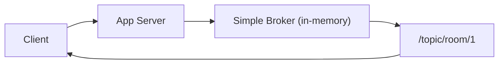
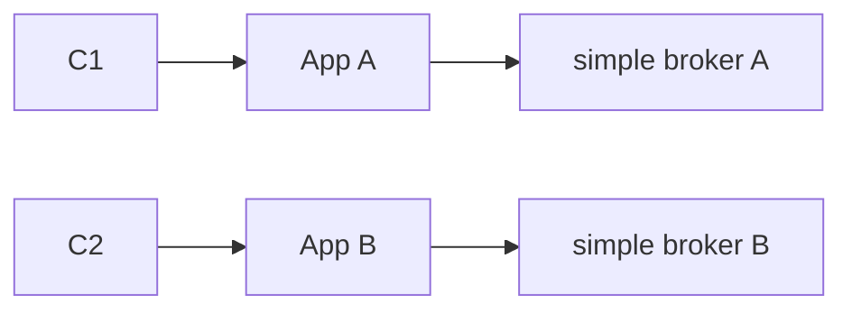
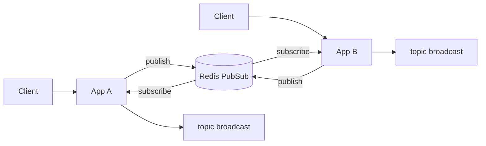
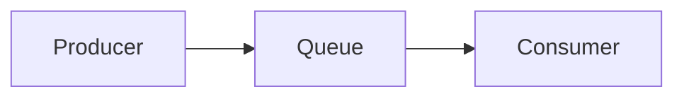
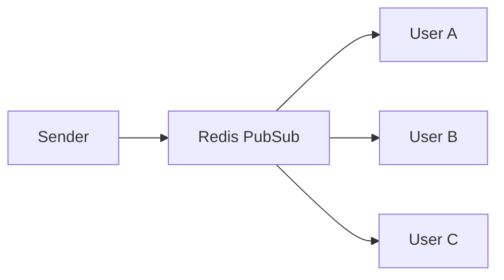

이 채팅 시스템(G0)의 목표는 단순한 “메시지 전달”이 아니라:

```
✔ 실시간 브로드캐스트
✔ 핫패스/콜드패스 분리
✔ 이후 scale-out 시 구조 유지
✔ 변경 비용 최소화
✔ 메시지 전파 경로 외부화
```

이를 위해 STOMP simple broker 대신

**Redis Pub/Sub 기반 fan-out 구조**를 채택했다.

Redis는 여기서 “캐시”가 아니라:

> **실시간 메시지 전파 허브 + 상태 처리용 인메모리 계층**
> 

역할이다.

---

# Simple Broker 구조의 한계

Spring STOMP 기본(simple broker)은 내부 메모리 브로커다.

## simple broker 구조



특징:

```
브로커 = 서버 내부
브로드캐스트 = 서버 메모리
```

즉:

```
App =1대 → 정상App = 여러대 → 구조 깨짐
```

---

## scale-out 시 문제

서버가 3대로 늘면:



결과:

```
A 서버 사용자 = A 메시지만 수신
B 서버 사용자 = B 메시지만 수신
```

👉 방 전체 브로드캐스트가 깨진다.

---

# Redis Pub/Sub 구조로 바꾸면

브로커를 서버 밖으로 뺀다.

## Redis fan-out 구조



이 구조의 핵심:

```
메시지 허브 = Redis
브로드캐스트 기준 = Redis
```

---

# Redis Pub/Sub을 쓰는 핵심 이유 4가지

---

# ① 메시지 fan-out 허브를 서버 밖으로 분리

목표:

```
메시지 전파 기준을 “서버 메모리”가 아니라
“외부 공통 계층”으로 이동
```

효과:

```
노드 수 무관 fan-out 유지
```

즉:

```
App =1 → 동일App =5 → 동일App =10 → 동일
```

---

# ② G0 → G0.5 구조 변경 비용 제거

만약 G0에서 simple broker 쓰면:

## G0 메시지 경로

```
SEND → server broadcast
```

## G0.5 메시지 경로

```
SEND → publish → subscribe → broadcast
```

👉 메시지 경로 전체가 바뀜

👉 테스트/버그/로그/흐름 전부 다시 검증해야 함

---

## Redis Pub/Sub을 G0부터 쓰면

```
G0 = publish → subscribe → broadcastG0.5 = publish → subscribe → broadcast
```

변경 없음.

> **인스턴스 수만 늘리면 된다**
> 

이게 실무에서 매우 중요하다.

---

# ③ 핫패스/콜드패스 분리 유지

채팅 시스템은 경로를 나눈다:

```
핫패스 = 실시간 전달
콜드패스 = 저장/분석
```

Redis Pub/Sub은 핫패스 전용 허브가 된다.

## 핫패스 흐름


## 콜드패스 흐름

```
SEND → bucket buffer → Mongo bulk 저장
```

분리 효과:

```
저장 지연 ≠ 실시간 전달 지연
```

---

# ④ Redis는 초고빈도 상태 처리에 강함

채팅에서 자주 바뀌는 값:

```
viewer count
presencelike countsession 상태
```

DB로 하면:

```
UPDATErow 반복
hotrowlock
경합 발생
지연 증가
```

Redis:

```
INCR = 원자 연산
메모리 기반
락 경합 없음
```

---

# Redis Pub/Sub vs 다른 메시징 비교

---

## Redis Pub/Sub vs Kafka

| 항목 | Redis Pub/Sub | Kafka |
| --- | --- | --- |
| 지연 | 매우 낮음 | 중간 |
| 영속성 | 없음 | 있음 |
| 재전송 | 없음 | 있음 |
| 순서 보장 | 약함 | 강함 |
| 복잡도 | 낮음 | 높음 |
| 채팅 적합성 | 매우 높음 | 과함 |

채팅은:

```
속도 > 보장
```

Kafka는:

```
보장 > 속도
```

---

## Redis Pub/Sub vs 큐(SQS)

메시지 큐(SQS 같은)는 기본적으로 이런 모델이다:

```
생산자 → 큐 → 소비자
```

그리고 핵심 특징:

```
메시지 1개 → 소비자 1명이 처리
```

---

## 큐 구조 그림



---

## 큐의 동작 방식

예를 들어:

```
주문 이벤트 발생
→ 큐에 메시지 저장
→ 워커1명이 가져가서 처리
→ACK(처리 완료 확인)
→ 큐에서 제거
```

즉:

```
1 메시지 = 1 처리자
```

---

## 큐는 이런 데 쓴다

```
✔ 주문 처리
✔ 결제 처리
✔ 이메일 발송
✔ 정산 작업
✔ 백그라운드 작업
```

공통점:

```
정확히 한 번 처리해야 함
실패하면 재시도해야 함
```

---

# 그럼 채팅 fan-out은 뭐가 다르냐

채팅은 구조가 완전히 다르다.

채팅 메시지는:

```
한 명이 보냄
→ 같은 방에 있는 모든 사람이 받아야 함
```

즉:

```
1 →N 전달
```

---

## 채팅 fan-out 구조



특징:

```
메시지 1개 → 여러 구독자가 동시에 받음
```

이걸 **fan-out(부채꼴 확산)**이라고 부른다.

---

# Redis Pub/Sub은 왜 채팅에 맞냐

Redis Pub/Sub은 이렇게 동작한다:

```
publish
→ 구독자 모두에게 즉시 전달
```

특징:

```
빠름
브로드캐스트 특화
구조 단순
지연 매우 낮음
```

채팅 요구사항과 딱 맞음:

```
속도 중요
동시 전달 중요
약간 유실 허용 가능
```

---

# 큐를 채팅에 쓰면 왜 이상해지나

큐는 기본이:

```
메시지 → 한 소비자만 가져감
```

채팅에 쓰면:

```
메시지 → 한 서버만 처리
→ 다른 사용자 못 받음
```

그래서 채팅 fan-out에는 **큐만으로는 부족**하다.

큐는:

```
작업 분배용
```

채팅은:

```
브로드캐스트용
```

목적이 다르다.

---

```
큐 = “한 번 처리” 용
Pub/Sub = “여러 명 전달” 용
```

---

# 메시지 순서 관련 판단

멀티 노드 + Pub/Sub 환경:

```
전역 순서 완전 보장 어려움
```

판단:

```
채팅 → 약간 순서 어긋남 허용
지연 최소화 우선
```

---

# 장애 시 fallback 가능

Redis 장애 시:


G0는 단일 인스턴스라 fallback 가능.

---

> 단일 서버 STOMP simple broker 대신 Redis Pub/Sub 기반 fan-out 구조를 적용하여 메시지 전파 허브를 서버 외부로 분리했습니다. 이를 통해 이후 멀티 인스턴스 scale-out 환경에서도 메시지 전파 구조를 변경하지 않도록 했고, 실시간 핫패스는 Redis, 저장은 Mongo bulk 콜드패스로 분리했습니다. Redis Pub/Sub은 유실 가능성이 있어 채팅·presence 같은 유실 허용 영역에만 사용하도록 설계했습니다.
>
