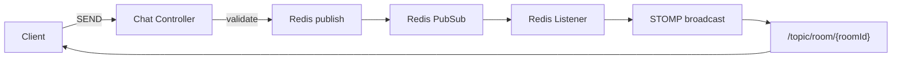
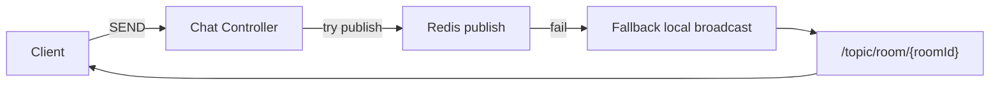

G0는 **단일 App 인스턴스 + Redis Pub/Sub fan-out 구조**를 사용한다.

Redis는 실시간 메시지 fan-out과 presence/viewer 상태 저장에 사용된다.

하지만 Redis는 외부 의존성이므로, 장애 발생 시 동작 정책을 명확히 정의해야 한다.

G0의 원칙:

```
✔ 채팅 서비스는 “완전 중단”하지 않는다
✔ 기능 저하는 허용한다
✔ 메시지 유실은 일부 허용한다
✔ 구조는 단순하게 유지한다
```

---

# 정상 fan-out 흐름 (Redis 정상 동작 시)



설명:

```
SEND → 서버 검증 → Redis publish
→ Redis subscriber listener 수신
→ STOMP topic broadcast
→ 구독자 수신
```

Redis는 fan-out 메시지 허브 역할을 한다.

---

# Redis 장애 시 fallback 흐름 (G0 정책)

Redis publish 실패 시:

```
fan-out 경로만 우회
채팅은 계속 전달
```



설명:

```
Redis publish 실패
→ 예외 캐치
→ 서버 내부 STOMP broadcast 직접 수행
```

G0는 단일 인스턴스이므로:

```
local broadcast = 전체 사용자 전달
```

즉, 채팅은 계속 동작한다.

---

# Fan-out Service 중단 시 메시지 처리 정책

Redis Pub/Sub fan-out이 중단되었을 때 처리 방식:

## 메시지 처리 전략

```
1️⃣ SEND 검증은 그대로 수행
2️⃣ Redis publish 시도
3️⃣ 실패 시 fallback broadcast
4️⃣ 콜드패스 저장은 계속 진행
```

즉:

```
실시간 전파 = fallback
저장 = 계속 수행
```

---

# Presence / Viewer Redis 장애 시 영향

Redis 기반 상태값:

```
room:{id}:users SET
room:{id}:viewer counter
```

Redis 장애 시:

```
presence 정확도 저하
viewer count 중단
```

G0 정책:

```
채팅 메시지 전달은 유지
viewer/presence는 일시 중단 허용
```

선택 fallback:

```
viewer ="unknown" 표시presence = 비활성 처리
```

---

# 왜 이런 정책을 쓰는가

## 이유 1 — 채팅은 유실 허용 영역

채팅 시스템 특성:

```
몇 개 메시지 유실
viewer count 오차
presence 지연
```

→ 서비스 전체 장애보다 훨씬 낫다.

---

## 이유 2 — G0는 단일 인스턴스

G0 구조:

```
App =1
```

따라서:

```
Redis fan-out 없이도 broadcast 가능
```

fallback이 성립한다.

---

## 이유 3 — 장애 격리 원칙

핫패스 설계 원칙:

```
외부 의존 장애가 전체 서비스 중단을 만들면 안 된다
```

Redis는:

```
가속 계층
실시간 계층
```

이지:

```
핵심 트랜잭션 계층이 아니다
```

---

# 허용 범위 / 비허용 범위

## 허용

```
✔ 메시지 일부 유실
✔ viewer count 일시 오류
✔ presence 정확도 저하
✔ Redis fan-out 비활성
```

## 허용 안 함

```
❌ SEND API 전체 중단
❌ 채팅 전면 마비
❌ WS 연결 차단
```

---

# Redis Pub/Sub 한계

Redis Pub/Sub은:

```
큐 아님
재전송 없음
ACK 없음
영속 저장 없음
```

따라서 적용 범위:

```
채팅
알림
presence
viewer count
```

비적용:

```
결제
주문
재고
쿠폰 확정
```

---

> Redis 장애 시 fan-out publish 실패를 감지하면 서버 내부 STOMP broadcast로 fallback하도록 설계했습니다. G0는 단일 인스턴스이기 때문에 메시지 전달은 유지되며, viewer/presence 같은 Redis 의존 기능만 일시 저하를 허용했습니다.
>
