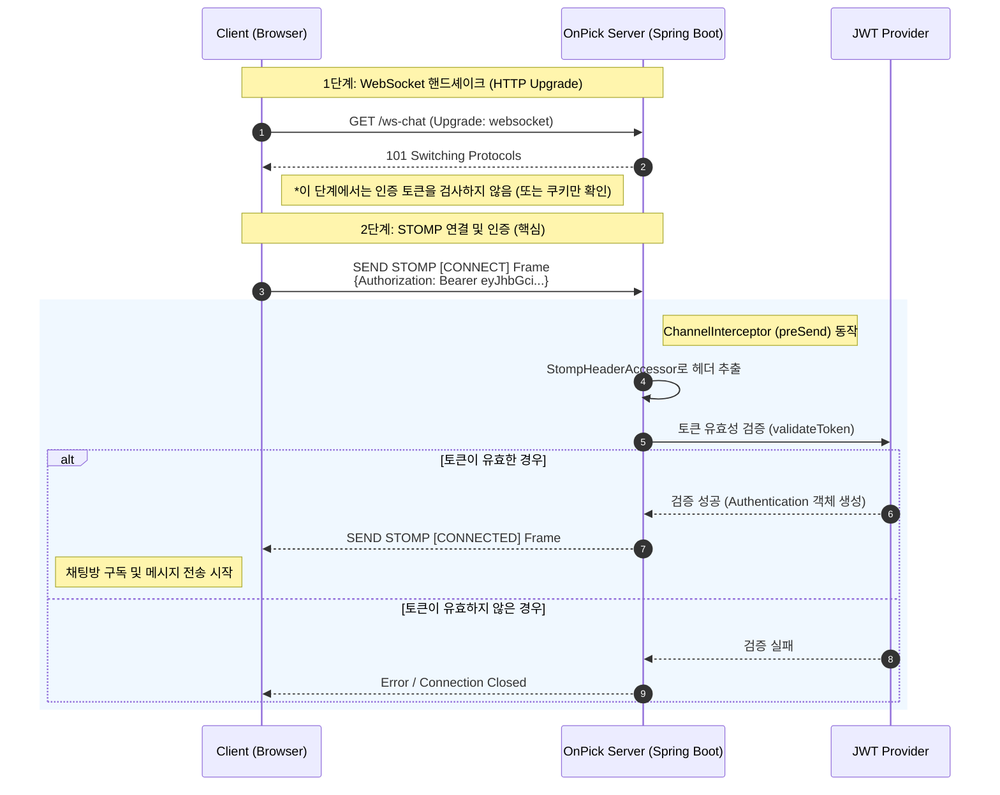

# [기술 의사결정] 쇼핑 라이브 채팅을 위한 WebSocket JWT 인증 방식

## 1. 배경 (Context)
**OnPick** 프로젝트는 대규모 트래픽이 예상되는 '쇼핑 라이브' 서비스를 제공하며, 채팅 기능은 사용자 경험의 핵심입니다.

* **요구사항:** 로그인된 사용자만 채팅에 참여할 수 있어야 하며, 표준화된 인증 방식인 JWT(Json Web Token)를 사용합니다.
* **문제점:** HTTP(REST API)와 달리 WebSocket은 연결 수립(Handshake) 과정에서 헤더 제어가 제한적이므로, JWT를 안전하고 효율적으로 전달할 방법을 결정해야 합니다.

## 2. 의사결정 (Decision)
**STOMP 프로토콜의 `CONNECT` 프레임 헤더에 JWT를 담아 전달하는 방식을 채택합니다.**

### 2.1 동작 흐름 시각화 (Sequence Diagram)
다음은 클라이언트와 서버 간의 연결 및 인증 과정을 나타낸 다이어그램입니다.



## 3. 대안 비교 및 선정 근거 (Alternatives & Rationale)

| 방식 | 설명 | 장점 | 단점 (기각 사유) |
| :--- | :--- | :--- | :--- |
| **Query Parameter** | URL 뒤에 토큰 부착<br>`ws://...?token=xxx` | 구현이 가장 쉬움. | **[보안 취약]** URL이 서버 로그, 브라우저 히스토리, 프록시 서버 등에 평문으로 남을 위험이 큼. |
| **HTTP Header** | 핸드셰이크 요청 헤더에 포함<br>`Authorization: Bearer` | REST API와 통일성 유지. | **[기술적 한계]** 표준 WebSocket API는 핸드셰이크 시 커스텀 헤더 설정을 지원하지 않음. 구현 복잡도가 높음. |
| **STOMP Header** | **(채택)** 연결 후 STOMP<br>`CONNECT` 프레임에 포함 | **[보안/호환성 우수]** 로그에 남지 않으며, 라이브러리 차원에서 헤더 설정을 완벽히 지원함. | 소켓 연결 자체는 열려있으므로, 연결 후 인증 실패 시 소켓을 끊는 로직 구현 필요. |

## 4. 구현 가이드 (Implementation)

### 4.1 Backend (Spring Boot)
`ChannelInterceptor`를 구현하여 STOMP 메시지가 브로커로 전달되기 전(`preSend`)에 가로채어 검증합니다.

```java
@Component
public class StompHandler implements ChannelInterceptor {
    @Override
    public Message<?> preSend(Message<?> message, MessageChannel channel) {
        StompHeaderAccessor accessor = StompHeaderAccessor.wrap(message);
        
        // STOMP CONNECT 명령일 경우에만 토큰 검증 수행
        if (StompCommand.CONNECT == accessor.getCommand()) {
            String jwt = accessor.getFirstNativeHeader("Authorization");
            // 토큰 검증 로직 수행 (유효하지 않으면 예외 발생 -> 연결 종료)
            jwtTokenProvider.validateToken(jwt);
        }
        return message;
    }
}
```

### 4.2 Frontend (Client)
`sockjs-client` 또는 `stompjs` 라이브러리 사용 시 `connectHeaders` 옵션을 사용하여 헤더에 토큰을 포함합니다.

```javascript
stompClient.connect({
    'Authorization': 'Bearer ' + accessToken // 헤더에 JWT 추가
}, function (frame) {
    // 연결 성공 시 로직
    console.log('Connected: ' + frame);
});
```

## 5. 추가 고려사항 (Next Steps)
* **토큰 만료 처리 (Token Expiration):**
  라이브 방송 시청 시간이 길어져 액세스 토큰이 만료될 경우를 대비해야 합니다. 소켓 연결이 끊어지지 않도록 관리하거나, 재연결(Reconnect) 시도 시 **리프레시 토큰(Refresh Token)**을 사용하여 새로운 액세스 토큰을 발급받아 헤더를 갱신하는 로직을 클라이언트에 포함해야 합니다.

* **예외 처리 (Exception Handling):**
  잘못된 토큰이나 만료된 토큰으로 접근 시, 클라이언트에게 명확한 에러 메시지(예: `401 Unauthorized`)를 전달할 수 있도록 백엔드에서 `StompSubProtocolErrorHandler` 등의 설정을 커스터마이징하여 에러 응답을 체계화할 필요가 있습니다.

