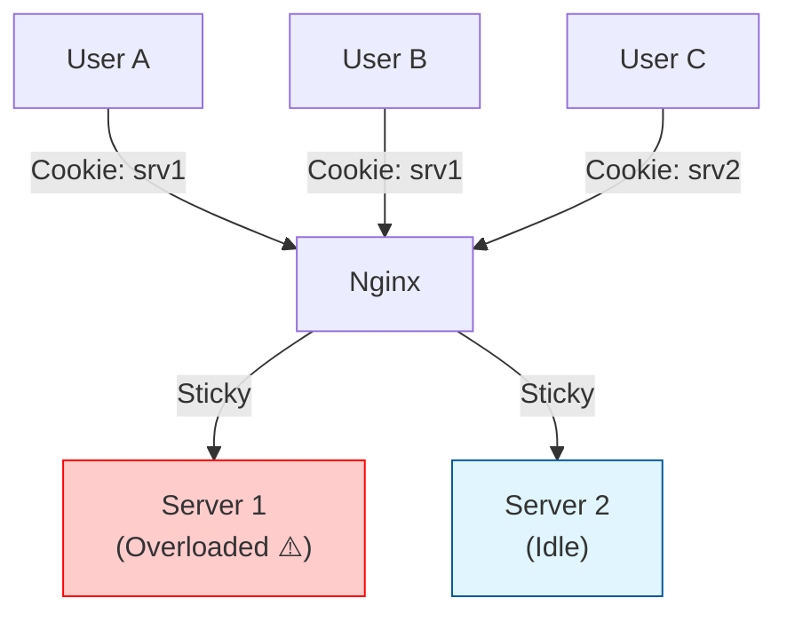
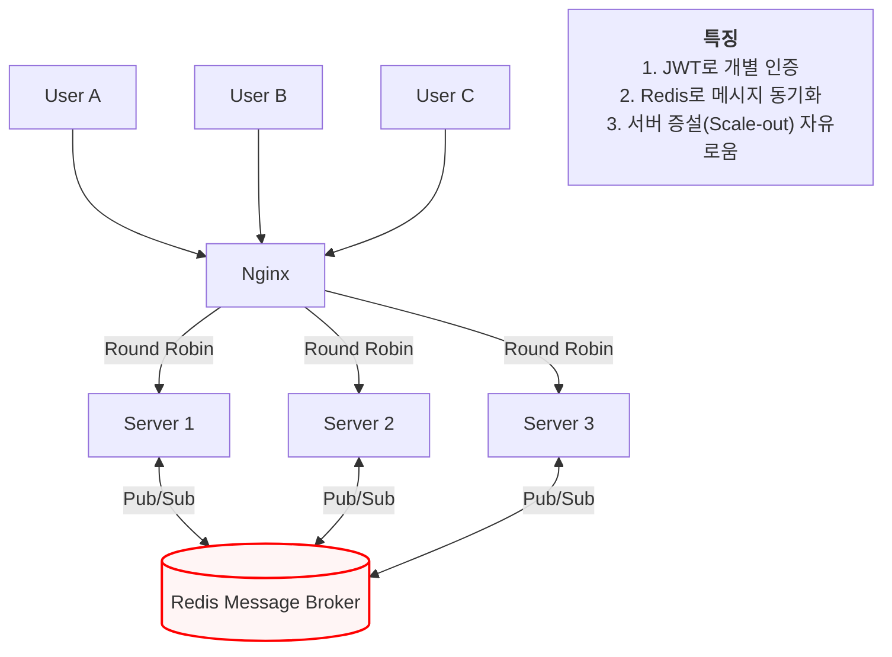

# [기술 의사결정] WebSocket 로드 밸런싱 전략 (Non-Sticky vs Sticky Session)

## 1. 배경 (Context)
OnPick의 라이브 채팅 서버는 Nginx를 리버스 프록시(Reverse Proxy)로 두고, 뒷단에 여러 대의 Spring Boot 애플리케이션 서버(Scale-out)를 배치하여 대규모 트래픽을 처리합니다.

* **문제 상황**: 다중 서버 환경에서 클라이언트의 요청을 어떤 서버로 보낼지 결정하는 로드 밸런싱 전략이 필요합니다.
* **고려 사항**: 일반적인 웹 세션 관리에서 사용되는 Sticky Session(세션 고정) 방식이 WebSocket 기반의 채팅 시스템에도 적합한지 검토가 필요합니다.

---

## 2. 의사결정 (Decision)
**Sticky Session을 사용하지 않습니다 (Non-Sticky).**

대신 Round Robin 또는 Least Connection 방식을 사용하여 트래픽을 고르게 분산하며, 모든 상태 관리는 외부 저장소(Redis)에 위임하는 Stateless 아키텍처를 채택합니다.

## 3. 대안 비교 및 선정 근거 (Rationale)

### 3.1 비교 분석

| 특징 | Sticky Session (사용 안 함) | Stateless / Non-Sticky (채택) |
| :--- | :--- | :--- |
| **작동 방식** | 특정 사용자를 처음 연결된 서버에 고정 (IP나 쿠키 기반). | 요청이 올 때마다 알고리즘(순차, 최소 연결 등)에 따라 서버 배분. |
| **서버 의존성** | 높음. 서버 메모리에 세션 상태가 있으면 다른 서버로 이동 불가. | 없음. 어느 서버에 붙어도 동일한 서비스 제공 가능. |
| **장애 대응** | 특정 서버 다운 시, 해당 서버에 고정된 유저들의 세션 정보 유실됨. | 서버 다운 시, 클라이언트가 재접속하면 즉시 다른 정상 서버가 처리. |
| **부하 분산** | 특정 서버에 헤비 유저가 몰리면 부하 불균형(Hotspot) 발생 위험. | 트래픽을 모든 서버에 고르게 분산하여 리소스 효율 극대화. |

### 3.2 핵심 선정 이유

#### ① Stateless 아키텍처의 완성 (JWT + Redis)
Sticky Session은 주로 "서버의 세션 저장소(Memory)에 로그인 정보가 있을 때" 필수적입니다. 하지만 OnPick은 다음과 같이 서버의 상태를 완전히 제거했습니다.

* **인증(Auth)**: JWT(Json Web Token)를 사용하여 어떤 서버가 요청을 받더라도 토큰만으로 유효성을 검증할 수 있습니다.
* **채팅 상태(State)**: 채팅방 입장 정보, 참여자 목록 등은 서버 메모리가 아닌 Redis에 저장됩니다.
* **결론**: 서버가 상태를 가지지 않으므로(Stateless), 굳이 사용자를 특정 서버에 묶어둘 기술적 이유가 없습니다.

#### ② WebSocket의 연결 특성 (Natural Sticky)
WebSocket은 HTTP와 달리 한 번 연결(Handshake)되면 TCP 연결이 지속(Persistent)되는 특성이 있습니다.

* 로드 밸런서가 최초 연결 시 적절한 서버(App 1)에 배정해주면, 소켓 연결이 끊어질 때까지 클라이언트는 자연스럽게 App 1하고만 통신합니다.
* 따라서 별도의 Sticky 설정 없이도 연결이 유지되므로, 인위적인 세션 고정 설정은 중복이자 불필요한 제약이 됩니다.

#### ③ Redis Pub/Sub을 통한 메시지 동기화
사용자가 서로 다른 서버에 접속해 있어도 대화가 가능해야 합니다.

* Sticky Session을 쓰지 않으면 유저 A(서버 1)와 유저 B(서버 2)가 서로 다른 서버에 연결될 수 있습니다.
* 이를 해결하기 위해 Redis Pub/Sub을 도입했습니다. 어떤 서버에 연결되어 있든 Redis라는 공통 채널을 통해 메시지가 실시간으로 브로드캐스팅되므로, 물리적인 서버 위치는 중요하지 않습니다.

---

## 4. 아키텍처 비교 시각화 (Architecture Diagram)

### 4.1 Sticky Session 사용 시 (Bad Pattern)
특정 서버에 트래픽이 쏠리거나, 장애 발생 시 유연한 대처가 불가능한 구조입니다.

### 4.2 Stateless & Redis Pub/Sub (Adopted Pattern)
모든 서버가 동등하게 트래픽을 처리하며, Redis를 통해 논리적으로 연결된 구조입니다.

## 5. 결론 (Conclusion)

**OnPick** 프로젝트는 **Sticky Session을 제거**함으로써 진정한 의미의 수평적 확장(Horizontal Scaling)이 가능한 시스템을 구축했습니다.

이는 특정 서버의 장애가 전체 서비스로 전파되지 않도록 하는 내결함성(Fault Tolerance)을 확보하고, Redis 기반의 분산 처리 능력을 증명하는 핵심 아키텍처입니다.
