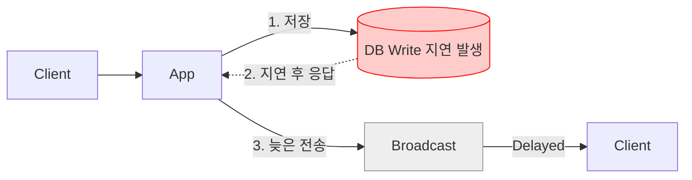
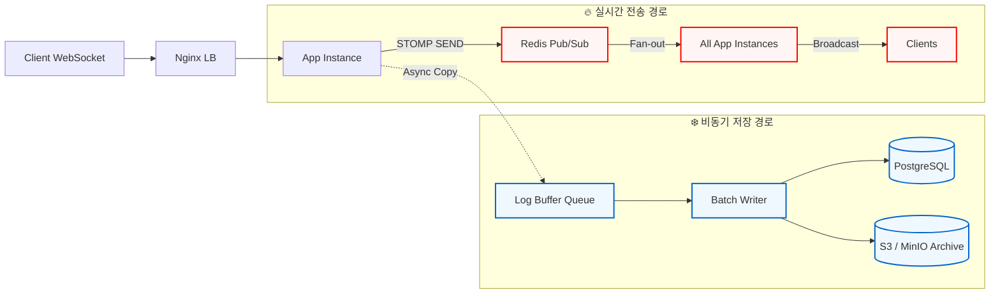
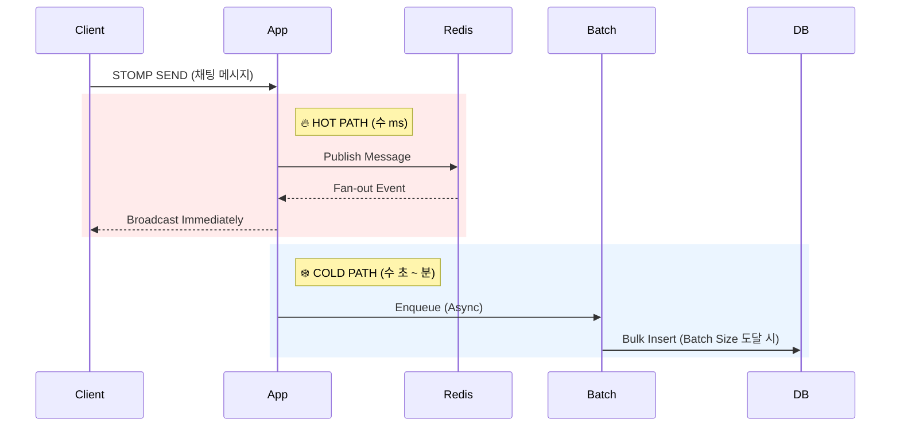

# [기술 의사결정] 실시간 채팅 성능 보장을 위한 핫패스(Hot Path)와 콜드패스(Cold Path) 분리

## 1. 배경 (Context)
**OnPick**의 라이브 커머스 채팅 환경은 수만 명의 사용자가 동시에 접속하여 초당 수천 건의 메시지가 발생할 수 있는 **High-Concurrency(동시성)** 환경입니다.

* **요구사항:** 채팅 메시지는 지연 없이 즉시 모든 시청자에게 전달되어야 합니다 (Real-time Guarantee).
* **문제점:** 메시지 전송과 동시에 'DB 저장', '로그 파일 기록', '통계 집계' 등의 무거운 작업을 동기적(Synchronous)으로 처리할 경우, I/O 지연이 전체 채팅 속도를 늦추는 병목 현상(Bottleneck)이 발생합니다.

## 2. 문제 정의: 통합 경로의 위험성 (Why not Single Path?)
모든 로직을 하나의 경로에서 처리할 경우, 장애 전파(Cascading Failure)가 발생합니다.

* **시나리오:** DB에 부하가 걸려 쓰기 지연(Latency)이 발생함.
* **결과:**
    1.  DB 저장이 완료될 때까지 메시지 브로드캐스팅이 대기함 (Block).
    2.  사용자 경험(UX) 심각하게 저하 (채팅 밀림 현상).
    3.  시스템 전체의 P95 Latency 급증.

## 3. 핵심 전략 (Decision)
시스템의 경로를 속도가 중요한 경로(Hot Path)와 안정성이 중요한 경로(Cold Path)로 물리적/논리적으로 분리합니다.

### 3.1 핫패스 (Hot Path) - "지연 절대 금지"
* **목적:** 사용자 체감 실시간성 극대화.
* **특징:** In-Memory 처리, 비동기, 초저지연, 저장 최소화.
* **기술 스택:** WebSocket, STOMP, Redis Pub/Sub.
* **흐름:** `Client` → `Server` → `Redis` → `Fan-out` → `Client`

### 3.2 콜드패스 (Cold Path) - "지연 허용 & 데이터 무결성"
* **목적:** 데이터 영구 저장 및 분석.
* **특징:** 디스크 I/O 허용, 배치(Batch) 처리, 재시도(Retry) 가능.
* **기술 스택:** Queue/Buffer, Batch Writer, PostgreSQL, S3.
* **흐름:** `Server` → `Async Queue` → `Batch Insert` → `DB/S3`

## 4. 아키텍처 상세 (Architecture Overview)
다음은 OnPick 프로젝트에 적용된 분리 구조입니다.

### 4.1 동작 시퀀스 (Sequence Diagram)
핫패스는 즉시 응답하고, 콜드패스는 백그라운드에서 별도로 동작함을 보여줍니다.

## 5. 도입 효과 및 결론 (Benefits & Conclusion)

1. **장애 격리 (Fault Isolation)**
   * DB나 S3에 장애가 발생하거나 지연되어도, 채팅 전송(Hot Path)은 전혀 영향을 받지 않습니다.
   * 이로 인해 채팅 서비스의 가용성(Availability)이 비약적으로 상승합니다.

2. **처리량 증대 (High Throughput)**
   * DB Insert를 건별로 수행하지 않고 **Batch(묶음) 처리**함으로써 I/O 비용을 획기적으로 줄였습니다. (Insert 1000회 -> Bulk Insert 1회)

3. **확장성 (Scalability)**
   * 실시간 처리가 필요한 Redis 노드와 저장이 필요한 DB 노드를 각각 독립적으로 스케일링할 수 있습니다.

### [참고] 왜 Redis를 핫패스에 사용했는가?
* **In-Memory Architecture:** 디스크 접근 없이 메모리에서 동작하여 마이크로초(µs) 단위의 응답 속도를 보장합니다.
* **Atomic Operations:** 동시성 문제가 발생하기 쉬운 채팅 환경에서 원자적 연산을 지원합니다.
* **Pub/Sub 모델:** 분산 서버 환경에서 효율적인 메시지 팬아웃(Fan-out) 처리에 최적화되어 있습니다.
