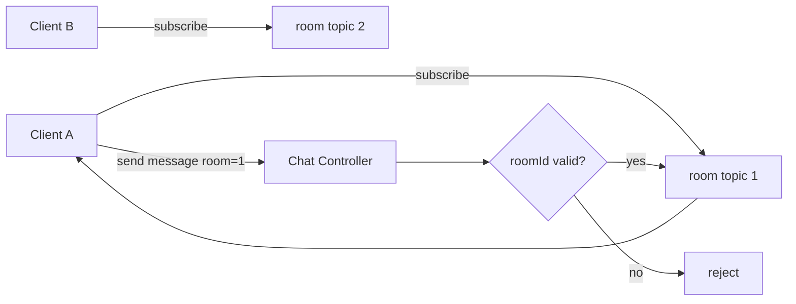
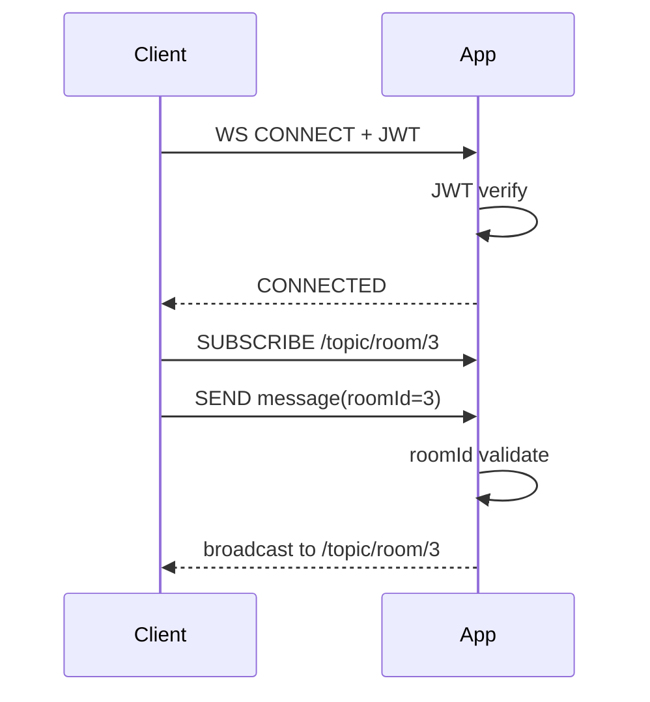

# 목표 (G0 기준)

```
✔ 사용자들이 채팅방(room)별로 메시지를 나눠서 받게 하기
✔ 다른 방 메시지가 섞이지 않게 하기
✔ 최소 구조로 먼저 완주하기
```

즉:

```
room1 → room1 사용자만 받음
room2 → room2 사용자만 받음
```

---

# 핵심 개념 — STOMP topic = 방송 채널

STOMP 기반 WebSocket 채팅에서는 **topic = 방송 채널**이라고 보면 된다.

우리는 topic을 이렇게 나눈다:

```
/topic/room/{roomId}
```

예:

```
/topic/room/1
/topic/room/2
/topic/room/3
```

의미:

```
이 topic을 구독한 사람만 메시지를 받는다
```

👉 서버가 “누구에게 보낼지”를 일일이 고르는 게 아니라

👉**topic 단위로 방송 → 구독자가 자동 수신**

---

# 전체 흐름 (G0 채팅 라이프사이클)

```
① 클라이언트 WS 연결
② JWT 인증 확인
③ 채팅방 선택
④ 해당 room topic 구독
⑤ 메시지 전송(SEND)
⑥ 서버가 SEND에서 roomId 검증
⑦ 해당 topic으로만 broadcast
```

중요:

```
구독 ≠ 참가 확정
구독 = 수신 등록
전송(SEND) = 실제 행위 발생
```

---

## roomId 검증 어디서 할까?

선택지:

```
A) SUBSCRIBE 시 검증
B) SEND 시 검증  ← G0 채택
```

G0에서는:

```
SUBSCRIBE = 읽기 등록
SEND = 쓰기 트리거
```

# 왜 SEND에서 검증하나?

## 핵심 원칙

```
SUBSCRIBE = 읽기 등록
SEND = 쓰기 트리거
```

읽기와 쓰기는 **시스템 영향도가 다르다.**

---

## SUBSCRIBE가 실제로 하는 일 (가벼움)

클라이언트:

```
SUBSCRIBE /topic/room/1
```

서버 내부 동작:

```
세션 → topic 구독 목록에 추가
```

보통:

```
DB 접근 없음
Redis 접근 없음
브로드캐스트 없음
로그 없음
```

### SUBSCRIBE 실패 시 영향

```
그 사용자만 메시지를 못 받음
```

👉 영향 범위 = **해당 사용자 1명**

---

## SEND가 실제로 하는 일 (무거움)

클라이언트:

```
SEND /app/chat.send
```

서버 내부 처리 흐름 (G0 기준):

```
DTO 파싱
JWT 사용자 확인
roomId 확인
메시지 길이 체크
금칙어 필터 
Redis publish
topic broadcast
Mongo bucket 버퍼 enqueue
통계 카운터 반영
```

> SEND = **실제 처리 파이프라인 실행 트리거**
> 

검증 위치:

```
@MessageMapping("/chat.send")
핸들러 메서드 내부에서 검증 수행

→ SUBSCRIBE 인터셉터가 아니라
→ SEND 처리 컨트롤러에서 검증
```

---

## SEND 실패 시 영향

검증 없이 SEND를 허용하면:

```
스팸 메시지 발생
브로드캐스트 발생
Redis publish 발생
로그 적재 발생
버퍼 적재 발생
네트워크 부하 발생
```

존재하지 않는 roomId라도:

```
리소스 사용
큐 적재
브로드캐스트 시도
```

👉 영향 범위 = **방 전체 + 시스템 자원**

---

## 영향 범위 비교

| 항목 | SUBSCRIBE | SEND |
| --- | --- | --- |
| 영향 | 개인 | 방 전체 |
| Redis | 없음 | 사용 |
| 브로드캐스트 | 없음 | 있음 |
| 로그 적재 | 없음 | 있음 |
| 부하 | 거의 없음 | 큼 |
| 악용 가능성 | 낮음 | 높음 |

---

## 그래서 나온 설계 원칙

```
검증 비용은 “위험한 지점”에 집중한다
```

따라서:

```
SUBSCRIBE → 단순화
SEND → 검증 집중
```

---

## SUBSCRIBE를 너무 엄격하게 막으면 생기는 문제

STOMP + SockJS 환경:

```
자동 재연결
자동 재구독
```

이때 구독 검증이 강하면:

```
연결은 됐는데 메시지가 안 옴
원인 추적 어려움
디버깅 난이도 상승
```

G0에서는:

> 연결과 구독은 항상 성공하도록 두고
> 
> 
> 검증은 SEND에 집중한다
> 

---

# SEND에서 반드시 검증할 것 (G0 체크리스트)

서버 `@MessageMapping` 처리 시:

```
✔ roomId 존재 여부
✔ sender 인증 여부 (JWT)
✔content 길이 제한
✔ 빈 메시지 여부
```

G0.5 이후:

```
✔ mute/ban
✔ ratelimit
✔ 권한
```

---

# 메시지 destination 설계

## 클라이언트 → 서버 (보내는 경로)

```
/app/chat.send
```

→ 서버 로직 진입 경로

## 서버 → 클라이언트 (방별 수신)

```
/topic/room/{roomId}
```

→ 방 단위 방송 경로

---

## 왜 분리하나?

```
/app → 서버 처리용
/topic → 브로드캐스트용
```

👉 **입력 경로와 출력 경로 분리 = 구조 명확 + 디버깅 쉬움**

---

# 메시지 DTO (G0 최소 필드)

```
messageId   : 클라이언트 멱등 처리용 (UUID)
roomId      : 어떤 방송 방인지(topic 라우팅)
senderId    : 보낸 사용자
type        : TALK | JOIN | LEAVE
timestamp   : 서버 생성 시각
content     : 메시지 본문
```

서버가 반드시 확인할 것:

```
roomId != null
content not empty
content length 제한
sender 인증됨
```

---

# 채팅방 구독 구조

---

## 구조도 — Room Topic 분리



---

```
각 방은 topic이 따로 있다
메시지는 검증 후 해당 topic으로만 간다
다른 방으로 안 새어 나간다
```

---

# 연결 + 구독 + 전송 시퀀스



---

# G0 테스트 체크리스트

## 방 분리 테스트

```
브라우저 2개
```

### A

```
room1 구독
```

### B

```
room2 구독
```

### A가 메시지 보내면:

```
A만 받아야 함B는 못 받아야 정상
```

---

> 채팅방 단위로 topic을 분리하고, SUBSCRIBE는 가볍게 허용하되 SEND는 브로드캐스트·Redis publish·로그 적재를 유발하는 트리거이므로 roomId와 사용자 검증을 SEND 경로에 집중하도록 설계했습니다.
>
